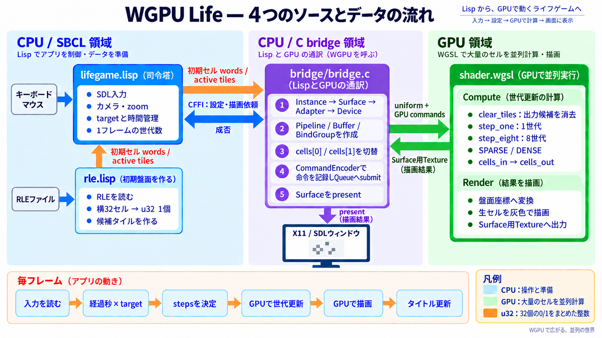

# WGPU Life 20000²

SBCL + wgpu-native で動く、20,000 x 20,000セルの Conway's Game of Life の実験です。
本プロジェクトは、OpenAI Codex の支援を受けて開発しました。

初期配置には [AM/PM両対応デジタル時計](https://codegolf.stackexchange.com/questions/88783/build-a-digital-clock-in-conways-game-of-life)
（10,284 x 6,796、B3/S23）を改造したものを使います。

## 構成図



最初にこの図で全体の流れを確認し、`lifegame.lisp` → `rle.lisp` → `bridge/bridge.c` → `shader.wgsl`
の順に読むと、CPUからGPUへ処理が渡る流れを追いやすくなります。
主要ソースには自分の理解のためにかなり冗長なコメントをつけています。

## 必要環境

共通で、64-bit版SBCL、Quicklisp、Quicklispパッケージの`cffi`、`sdl2`、`bordeaux-threads`、
SDL2、wgpu-native、およびWebGPU対応のハードウェアGPUが必要です。

### WSL

- WSLではWSLgとWindows側GPUドライバ。SDL video driverの既定値はX11です。
- `/usr/lib/wsl/lib/libd3d12core.so`と`libd3d12.so`は、存在する場合だけLisp側が
  先にloadします。通常のLinuxでは要求しません。

### Windows

- SDL2 と wgpu-native は MSYS2 UCRT64 のもので動作確認しています。
- bridge.c ビルドには MSYS2 MinGW を使用して動作確認しています。

## 起動

初回起動前に、リポジトリ直下でスナップショットを解凍します。

```sh
unzip clock-snapshot-ampm.zip
```

解凍すると、`clock-snapshot-ampm/`に10分刻みRLEが144枚作られます。

### WSLでのビルドと起動

次の手順でビルドして起動します。

```sh
cd bridge
sh build.sh
cd ..
sbcl --load lifegame.lisp
```

### Windowsでのビルドと起動

```bat
cd bridge
build-msvc.bat
cd ..
sbcl --load lifegame.lisp
```

起動すると、システムのローカル時刻より前にある直近10分のスナップショットを読みます。たとえば
14:37なら`clock-14-30.rle`です。そのあとウィンドウを隠したまま、14:30から現在までの
分・秒だけをGPUで進めます。同期が完了してから初めて画面を開き、以後は実時間速度の
192 gen/sで動きます。
ローカル時刻はOSのタイムゾーン設定から取得し、特定のタイムゾーンへ固定しません。

Life時計の信号は、上部の基準クロックから下部の数字表示へ届くまで時間がかかります。
見た目の時刻を合わせるため、起動同期では11,520世代を追加で進めます。
これは60秒分の表示補正であり、スナップショット自体の世代番号は変更しません。

同期後は5分ごとにOSのシステム時計と比較します。Life側が遅れていれば不足世代を
追加し、進みすぎていれば自動更新を一時的に待つため、長時間動かしたときのずれを
小さく保てます。手動で速度を192 gen/s以外へ変えている間は補正を保留します。

GPU同期の1回の上限は1,024世代です。
C側の`WGPU_AdvanceLife`は、それを1個のコマンドバッファとして送ります。補正を含む起動時点の差は最大126,528世代
なので、0:00から最大約1,659万世代を計算していた方式より起動待ちが短くなります。
進捗はターミナルに表示します。

初期配置をすぐ確認したい場合や自動テストでは、同期を無効にして起動できます。

```sh
LIFEGAME_NO_AUTOSTART=1 sbcl --load lifegame.lisp
```

```lisp
(lifegame::main :sync-to-local-time nil)
```

## 操作

| 操作 | 機能 |
|---|---|
| マウスホイール | カーソル位置を中心に拡大・縮小 |
| 左ドラッグ | パン |
| `Space` | 実行・一時停止 |
| `Right` | 一時停止して1世代進める |
| `Up` / `Down` | targetを次 / 前の速度段階へ変更 |
| `V` | 表示方式をFIFO（VSyncあり）/ Immediate（VSyncなし）で切替 |
| `F` | 20,000 x 20,000の全景に戻す |
| `R` | 起動時に読み込んだ配置へ戻して一時停止 |
| `Esc` | 終了 |

タイトルの `target` は要求速度、`actual` は直近約1秒の世代進行速度で、どちらも
単位はgen/sです。
`fps`には直近約1秒の描画フレーム数を表示します。1フレームの最大更新は
256世代に制限し、ウィンドウ操作が長時間固まるのを避けています。
タイトルには現在の表示方式も`FIFO`または`IMMEDIATE`として表示します。
既定のFIFOはティアリングを防ぎます。Immediateは垂直同期を待たないため性能測定に
向きますが、画面が途中でずれて見える場合があります。SurfaceがImmediateに未対応なら
FIFOへ自動的に戻し、ターミナルへ通知します。起動時からImmediateにする場合は
`(lifegame::main :present-mode :immediate)`を使用できます。
`target`は1～5 gen/sでは
1刻み、その後は10～300 gen/sまで10刻みで選択できます。実時間の時計速度に対応する
192 gen/sも追加段階として含まれます。ローカル時刻同期での起動時は192 gen/s、
同期を無効にした起動時は50 gen/sです。
実時間の時計速度である192 gen/sを選択中は、タイトルのtargetを`*192*`と表示します。

zoomは`1.25^n cell/px`の段階で変化し、`n = 0`の`1.0 cell/px`が等倍です。
起動時は`n = 16`（約35.53 cell/px）で、範囲の端は0.05～64 cell/pxです。
`F`による全景表示も、盤面全体が収まる最小のzoom段階を選びます。

更新モードはLispのグローバル変数`lifegame::*sparse-mode*`で指定します。既定値の`t`は
SPARSE、`nil`はDENSEです。REPLから実行中に変更した場合も反映されます。

```lisp
(setf lifegame::*sparse-mode* t)   ; SPARSE
(setf lifegame::*sparse-mode* nil) ; DENSE
```

## 実装

横32セルを1個の `u32` に格納するため、セル本体は1面約47.7 MiB、ダブルバッファで
約95.4 MiBです。盤面は128 x 128セル単位のタイルに分け、生存セルがあるタイルと
その周囲だけをGPU上の候補リストに保持します。SPARSEでは、通常更新・8世代一括更新とも、
このリストを `dispatchWorkgroupsIndirect` で処理します。更新shaderは生存セルが残ったタイルから
次の候補を重複排除しながら直接リストへ追加するため、別の全タイル圧縮passはありません。
このモードでは空タイルにLifeの近傍計算を行いません。
初期化・リセット用の候補リストは、RLEを展開するLisp側で生存セル位置から同時に生成し、
セル本体とともにGPUへ転送します。

通常更新は1スレッドで32セルをビット並列処理します。8世代一括更新では候補タイルへハローを
付け、workgroupメモリ内で8世代まとめて更新します。疎タイルモードでは出力面全体ではなく、
出力先に前回記録された候補タイルだけをクリアし、古いセルが残らないようにしています。
グローバル変数で全24,649タイルを直接dispatchする全域モードへ切り替え、同じ盤面・速度で比較できます。
縮小表示では画面ピクセルが覆うセル範囲のORを取るため、細い回路も全景で視認できます。

盤面外は死セルとして扱います。時計パターンは中央配置され、元の10,016 x 6,796の
boxが20,000 x 20,000内に収まります。外枠は画面上1px幅の青線です。
